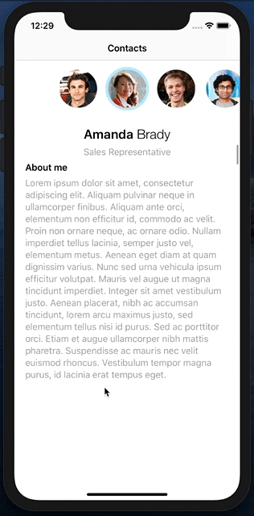

# Contacts

## Challenge
This iOS coding challenge is part of the interview process for the iOS engineer role at Outlook Mobile iOS team at Microsoft Suzhou. I have completed this challenge without any outside help. It took me a little over 2 business days worth of work to complete this challenge. I've tried my best to replicate all the behaviors exhibted in the [video of the Contacts app](challenge.mov). The requirements of the orignal challenge can be found here:
https://github.com/outlook/jobs/blob/master/instructions/ios/ios-engineer.md 

## Implementation
This is a single view app. The main view can be broken into two collection views (top: profile image collection view, bottom: profile information collection view). Profile image collection scrolls horizontally, and profile information collection view scrolls vertically. I followed the model view controller (MVC) design pattern in this project. The app is data driven with the data derived from the [contacts.json](contacts.json) and images from [avatars.zip](avatars.zip). I used storyboard and autolayout for building the view. In my view controller, I overriden some of the methods from UICollectionViewDataSource, UICollectionViewDelegate, and UICollectionViewLayout to achieve the desired behavior. I find this to be a balanced approach between using storyboard and code.

## Features
- Synchronize scrolling between the profile image collection view and profile information collection view
- Update selection when either of the collection view is being scrolled
- Enable paging on the bottom collection
- Center the profile image cell when it is selected
- Stop the scrolling with a profile image cell in the center of the profile image collection view
- Animate a shadow showing and hiding during and after scrolling

## Limitations
I do not wish to overcomplicate the problem. My goal is to replicate the behavior exhibit in [video of the Contacts app](challenge.mov). Therefore I've set forth the following limitations for myself so that the challenge can be completed within a reasonable timeframe. 

- No third party library was used in this project as required by the challenge.
- The cirlcular profile images are set to a fixed size of 80 px by 80 px instead of dynamically sized.
- The app is set to portrait only. If I were to add support for landscape mode, I would use an alternative layout to have the profile image collection view on the left hand side of the screen and make it scroll vertically. 
- Image caching was NOT included in this project. However, I can see it being necessary as the data size grows. In that case, I would use third party library for caching. 
- The shadow animation is triggered by scrolling either of the top or bottom collectin view. The [video of the Contacts app](challenge.mov) only showed it triggered by scrolling on the bottom collection view.
- Tests were done on iPhone 8, and iPhone 11, and iPhone 11 plus in the simulator. No test was done on iPad.

## Result 

Here is a screen recording of the app running in the simulator:
[Demo Video](ContactsDemoRecording.mov)
